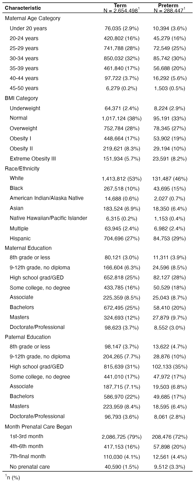
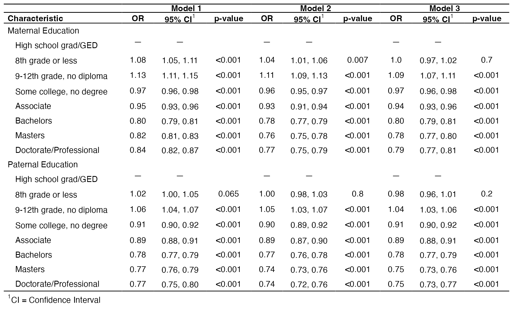

# Parental Education and Preterm Birth: A Comparison of Maternal and Paternal Education

## Introduction

Preterm birth, defined as delivery before 37 weeks of gestation, is a leading cause of infant morbidity and mortality in the United States. In 2022, preterm birth affected about 1 in 10 infants born in the United States, and racial and ethnic disparities persist—the rate among Black women was about 50% higher than among White or Hispanic women [1].
 
Parental education is a well-established social determinant of birth outcomes, but research has focused overwhelmingly on maternal education, with paternal education rarely examined. Prior work suggests paternal education may be an important additional marker of risk for preterm birth, reflecting social and economic factors not captured by maternal education or family income [2]. However, findings on whether maternal and paternal education have differential effects remain mixed; one large birth cohort found maternal education more strongly associated with adverse outcomes than paternal, though both associations were weaker than previously reported [3]. This analysis compares how maternal and paternal education predict preterm birth in the United States, using 2024 national birth certificate data.
 
**Research question:** How do maternal and paternal education compare as predictors of preterm birth, after adjusting for maternal age, race/ethnicity, and prenatal care?

## Methods

Birth records were drawn from the 2024 National Vital Statistics System (NVSS) natality file and restricted to singleton births. The outcome was preterm birth, defined as delivery before 37 weeks of gestation. The primary exposures were maternal and paternal educational attainment, each ranging from eighth grade or less to a doctorate or professional degree, with high school graduate as the reference category. Maternal age, race/ethnicity, and month prenatal care began were included as covariates.

Data were prepared in SQL and analyzed in R. Associations between each predictor and preterm birth were estimated using logistic regression, reported as odds ratios with 95% confidence intervals. To evaluate the independent contribution of parental education, models were fit sequentially, beginning with education alone and adding demographic and prenatal care covariates in turn. Multicollinearity was evaluated using variance inflation factors, and model fit was compared using the Akaike Information Criterion. The primary analysis was restricted to complete cases (N ≈ 2.9 million); a sensitivity analysis retaining missing values produced consistent results.

## Results

The analytic sample included approximately 2.9 million singleton births. Table 1 shows sample characteristics by preterm status.

**Parental education.** Higher education was associated with lower odds of preterm birth for both maternal and paternal education. After adjustment, paternal education showed a slightly stronger association than maternal education at every degree level. A paternal bachelor's degree was associated with 22% lower odds of preterm birth (OR 0.78), compared with 16% lower for a maternal bachelor's degree (OR 0.84). The protective factor plateaued at the bachelor's level for both parents, with the association similar for master's and doctoral degrees.

**Stability across models.** Education estimates were stable across the sequential models (Table 3). Adding age, race/ethnicity, and prenatal care did not change the odds ratios for the higher education levels, indicating that education is mostly independent of these factors. The higher odds for the lowest category (8th grade or less) in the smaller models were either null or close to null in the fully adjusted model, indicating that association could be explained by differences in age, race/ethnicity, and prenatal care across education groups.

**Model diagnostics.** Variance inflation factors were within limits (adjusted GVIF < 1.2 for all variables), indicating that despite moderate correlation between maternal and paternal education, both could be reliably estimated in the same model. Model fit improved slightly with each set of covariates (AIC: 1,876,756 for education alone; 1,858,596 for the full model).

**Covariates.** Maternal age had the highest odds among mothers aged 45–50 (OR 2.51). Black mothers had 51% higher adjusted odds of preterm birth than White mothers (OR 1.51). Table 2 shows full unadjusted and adjusted results.

### Table 1. Sample Characteristics by Preterm Status

### Table 2. Unadjusted and Adjusted Odds Ratios for Preterm Birth

### Table 3. Education Odds Ratios Across Sequential Models

## Discussion

Both maternal and paternal education independently predicted preterm birth, with higher education associated with lower odds. Notably, paternal education was at least as strong a predictor as maternal education, a finding that stands out given the research emphasis on mothers. This suggests household-level socioeconomic factors, not just maternal characteristics, are relevant to preterm birth risk.

The stability of education estimates across sequential models strengthens this conclusion as the protective association at higher education levels changed slightly as covariates were added, indicating it is not simply explained by age, race, or prenatal care.

**Limitations.** Birth certificate data lacks information on income, insurance, neighborhood, and stress, all likely confounders, so residual confounding remains and results should not be interpreted as causal. Paternal education was missing for a notable share of records, though sensitivity analyses suggested findings were robust to this. Finally, with a sample this large, nearly all associations were statistically significant, so interpretation should focus on effect size rather than p-values.

## Conclusion

Both maternal and paternal education were independent predictors of preterm birth, with paternal education showing an association at least as strong as maternal education. These findings suggest that paternal and household-level factors deserve greater attention in research on birth outcomes, which has traditionally focused on mothers. While the analysis cannot establish causation, it highlights parental education as a marker of preterm birth risk worth further study with more socioeconomic data.

## Tools Used

SQL, R (dplyr, ggplot2, gtsummary, broom)

## Data Source

National Vital Statistics System (NVSS) 2024 Natality public-use file, CDC/NCHS. The raw data file is large and not included in this repository. It can be downloaded from the CDC NVSS website: https://www.cdc.gov/nchs/nvss/births.htm

## References
 
1. Centers for Disease Control and Prevention. Preterm Birth. Maternal and Infant Health. https://www.cdc.gov/maternal-infant-health/preterm-birth/
2. Shapiro GD, et al. Father's Education: An Independent Marker of Risk for Preterm Birth. *Maternal and Child Health Journal.* 2010.
3. The influence of maternal and paternal education on birth outcomes: an analysis of the Ottawa and Kingston (OaK) birth cohort. *Journal of Maternal-Fetal & Neonatal Medicine.* 2022;35(25).
